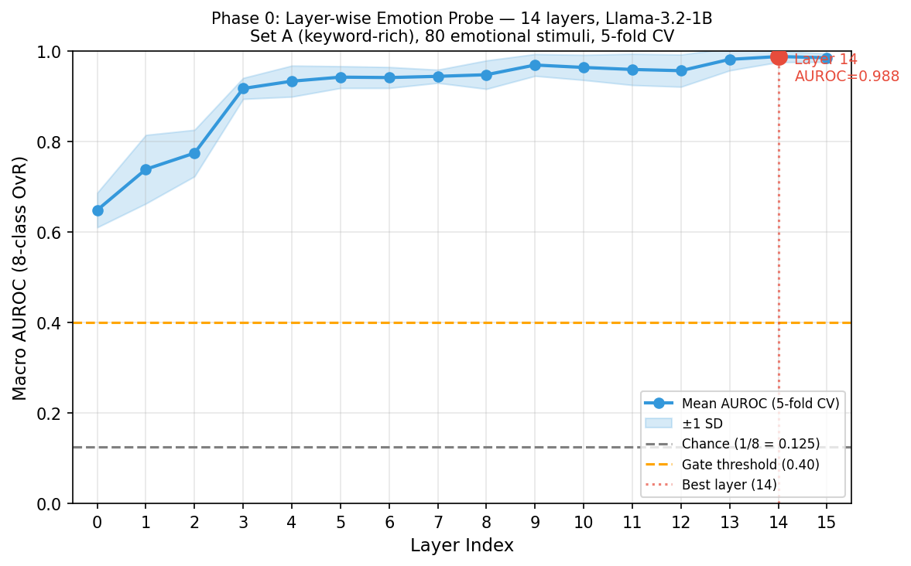
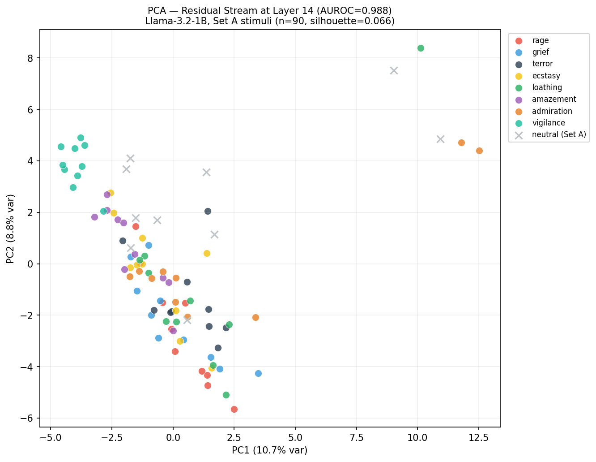
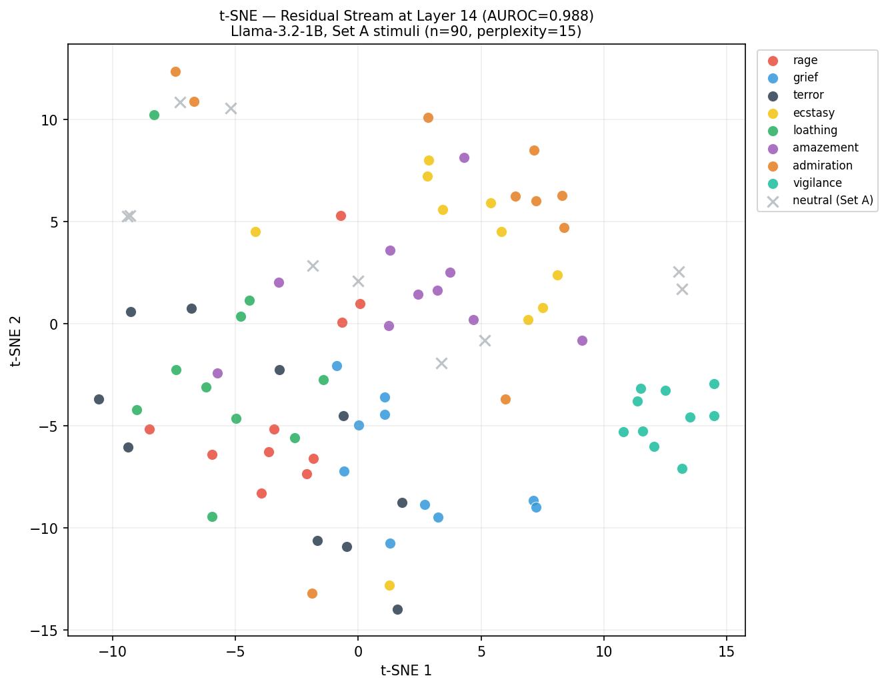

# Phase 0 Reproduction Study — Results

**Date:** 2026-02-24
**Model:** meta-llama/Llama-3.2-1B (Llama-3.2-1B, 16 layers, d_model=2048)
**Stimuli:** Set A standard (n=90 total: 80 emotional + 10 neutral)
**Task:** 8-class emotion classification via linear probes on residual stream activations

---

## Research Question

Do mid-layers of Llama-3.2-1B encode emotion category information that is
linearly decodable from the residual stream, when probed with keyword-rich stimuli (Set A)?

## Hypothesis

A linear probe trained on residual stream activations at mid-layers will achieve
macro AUROC > 0.40 (well above chance of 0.125), confirming that emotion category
information is encoded in the model's internal representations.

## Gate Criterion

Phase 0 passes if: **best layer AUROC > 0.40**

---

## Results

### Gate Decision: PASS

**Gate: PASS** — Emotion category information is decodable from Llama-3.2-1B residual stream with Set A (keyword-rich) stimuli. Proceeding to Phase 1 (clinical validity test).

### Section 1: Layer-wise Linear Probes

**Method:** 5-fold stratified cross-validation, LogisticRegression (OvR, max_iter=1000),
macro AUROC across 8 emotion classes.
- Stimuli: 80 emotional stimuli (8 classes × 10 each)
- Chance level: 0.125 (1/8 classes)
- Gate threshold: 0.40

**Best layer: 14** — AUROC = **0.9875** ± 0.0124
- Improvement over chance: 0.8625 (690.0% relative)

| Layer | Mean AUROC | Std |
|-------|-----------|-----|
|  0 | 0.6482 | 0.0382 |
|  1 | 0.7384 | 0.0758 |
|  2 | 0.7741 | 0.0514 |
|  3 | 0.9170 | 0.0232 |
|  4 | 0.9330 | 0.0343 |
|  5 | 0.9420 | 0.0241 |
|  6 | 0.9411 | 0.0232 |
|  7 | 0.9437 | 0.0146 |
|  8 | 0.9473 | 0.0315 |
|  9 | 0.9688 | 0.0241 |
| 10 | 0.9634 | 0.0279 |
| 11 | 0.9589 | 0.0345 |
| 12 | 0.9563 | 0.0356 |
| 13 | 0.9812 | 0.0245 |
| 14 | 0.9875 | 0.0124 | **← best**
| 15 | 0.9848 | 0.0092 |

### Section 2: Representational Geometry at Layer 14

**PCA analysis:**
- PC1 + PC2 explain 19.5% of variance in layer 14 residual stream
- Silhouette score on PCA-10 space (emotional stimuli only): **0.0657**
  - Range: -1 to 1; values > 0.1 suggest separable emotion clusters
- Silhouette = 0.0657: weak cluster structure — emotions not clearly separated in PCA space

**t-SNE analysis:**
- Computed from PCA-50 space (perplexity=15, n_iter=1000, seed=42)
- Visual cluster structure assessed from scatter plot

---

## Methodology

1. **Stimulus set**: 90 Set A standard stimuli loaded from `stimuli/set-a-standard.jsonl`
   - 80 emotional: 8 Plutchik primaries × 10 stimuli each (keyword-rich, first-person narratives)
   - 10 neutral: matched controls from crowd-enVENT `no-emotion` category
2. **Activation extraction**: `experiments/00_phase0_replication/extract.py`
   - Final-token residual stream (`cache["resid_post", layer][:, -1, :]`) at all 16 layers
   - Saved as: `outputs/activations/set_a_residuals.npy` — shape (90, 16, 2048)
3. **Linear probes**: `sklearn.LogisticRegression` (OvR, lbfgs solver, max_iter=1000)
   - 5-fold stratified CV, `roc_auc_score(multi_class="ovr", average="macro")`
4. **Geometry**: PCA (50 components) → t-SNE (from PCA-50 space, perplexity=15)
   - Silhouette score on PCA-10 space, euclidean metric

## Validation Notes (from pre-experiment checks)

From `validation/token_counts.py`:
- 59/96 Set B clinical/neutral pairs exceed ±10% token count threshold
- Clinical vignettes are systematically longer than their neutral controls
- This is a confound to be addressed in Phase 1 stimulus curation

From `validation/lexical_screening.py`:
- Set A emotional: mean sentiment polarity = -0.238 (keyword-laden, mostly negative)
- Set B clinical: mean polarity = -0.071 (near-neutral — keyword control working)
- Set A vs Set B: Mann-Whitney U p=0.0003 (significantly different — as intended)
- Set B vs neutral: p=0.4022 (not significantly different — keyword control validated)

## Outputs

- `outputs/activations/set_a_residuals.npy` — raw activations, shape (90, 16, 2048)
- `outputs/activations/metadata.json` — index → stimulus metadata
- `outputs/results.csv` — per-layer AUROC mean and std
- `outputs/auroc_curve.png/.svg` — layer-wise AUROC visualization
- `outputs/pca_scatter.png/.svg` — PCA visualization at best layer
- `outputs/tsne_scatter.png/.svg` — t-SNE visualization at best layer

## Random Seeds

- `torch.manual_seed(42)`, `np.random.seed(42)` set in all scripts
- `StratifiedKFold(random_state=42)`, `LogisticRegression(random_state=42)`
- `PCA(random_state=42)`, `TSNE(random_state=42)`

## Next Steps

- Proceed to Phase 1: Test with Set B (keyword-free clinical vignettes)
- Replicate Set A probing with Set B clinical stimuli (controlled stimulus set)
- Examine which neurons/attention heads contribute most to emotion differentiation
- Ablation study: which layers are necessary vs. sufficient for emotion decoding